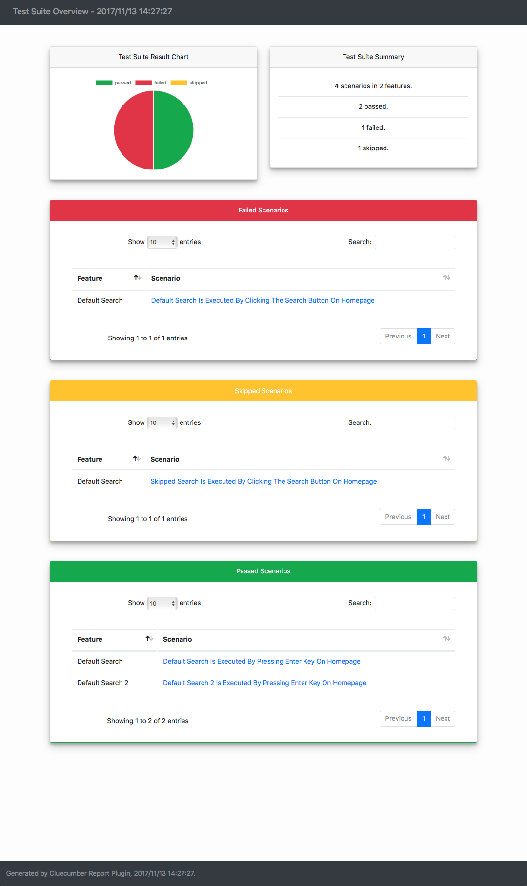
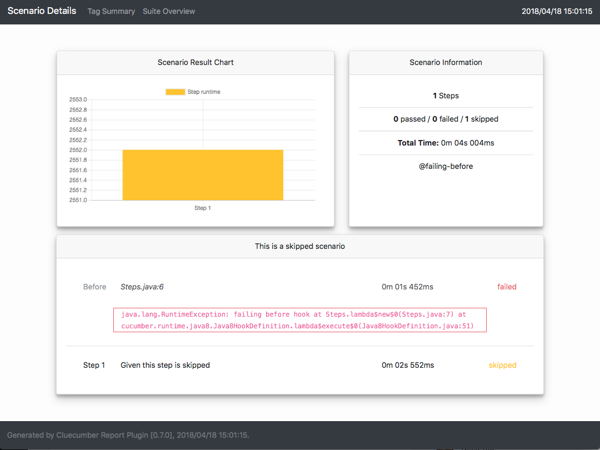

### Clear and Concise Cucumber Reporting

[](http://www.apache.org/licenses/LICENSE-2.0)
[](http://repo1.maven.org/maven2/com/trivago/rta/cluecumber-report-plugin/)
[](https://travis-ci.org/trivago/cluecumber-report-plugin)
[](https://codecov.io/gh/trivago/cluecumber-report-plugin)
[](https://twitter.com/bischoffdev)


<!-- START doctoc generated TOC please keep comment here to allow auto update -->
<!-- DON'T EDIT THIS SECTION, INSTEAD RE-RUN doctoc TO UPDATE -->

- [Cluecumber Report Maven Plugin](#cluecumber-report-maven-plugin)
  - [Changelog](#changelog)
- [Prerequisites](#prerequisites)
- [Maven POM settings](#maven-pom-settings)
  - [Mandatory Configuration Parameters](#mandatory-configuration-parameters)
    - [sourceJsonReportDirectory](#sourcejsonreportdirectory)
    - [generatedHtmlReportDirectory](#generatedhtmlreportdirectory)
  - [Optional Configuration Parameters](#optional-configuration-parameters)
    - [CustomParameters](#customparameters)
      - [Example](#example)
- [Generated pages](#generated-pages)
  - [Test suite overview page](#test-suite-overview-page)
  - [Scenario detail pages](#scenario-detail-pages)
- [Building](#building)
- [License](#license)

<!-- END doctoc generated TOC please keep comment here to allow auto update -->

# Cluecumber Report Maven Plugin

This plugin creates aggregated test reports from Cucumber JSON files.

This project was created because
- some other projects are using legacy technology and/or were not maintained at all
- some other projects generate partial or even full HTML code in Java making it hard to maintain
- the reporting generated from other plugins showed too much unneeded or even wrong information
- some other projects consume a large amount of memory when generating reports from large JSON files
- it will allow to completely customize the report appearance and information

**Note:** If you need to run Cucumber tests in parallel, please check out our [Cucable](https://github.com/trivago/cucable-plugin) project!

## Changelog

All changes are documented in the [full changelog](CHANGELOG.md).

# Prerequisites

In order to have the JSON files as a source for the Cluecumber Report generation, you need to specify this option in your Cucumber runner configuration:

*Cucumber 1.x:*
```
@CucumberOptions(
    format = {"json:target/cucumber-report/cucumber.json"}
)
```

*Cucumber 2.x:*
```
@CucumberOptions(
    plugin = {"json:target/cucumber-report/cucumber.json"}
)
```

This will generate JSON results for all Cucumber tests.

# Maven POM settings

```xml
<plugin>
    <groupId>com.trivago.rta</groupId>
    <artifactId>cluecumber-report-plugin</artifactId>
    <version>Check the version number above</version>
    <executions>
        <execution>
            <id>report</id>
            <phase>post-integration-test</phase>
            <goals>
                <goal>reporting</goal>
            </goals>
            <configuration>
                <sourceJsonReportDirectory>${project.build.directory}/cucumber-report</sourceJsonReportDirectory>
                <generatedHtmlReportDirectory>${project.build.directory}/generated-report</generatedHtmlReportDirectory>
            </configuration>
        </execution>
    </executions>
</plugin>
```

## Mandatory Configuration Parameters

There are two mandatory parameters that have to be specified within the Maven POM ```configuration``` section:

__Note:__ Typically, both properties point to directories inside the Maven ```target``` directory.

### sourceJsonReportDirectory

This specifies the source folder of the Cucumber JSON result files.

### generatedHtmlReportDirectory

This points to the root directory of the generated Cluecumber HTML report.

## Optional Configuration Parameters

### CustomParameters

The ```CustomParameters``` block can be used to define custom information that should be displayed on the report start page.

__Note:__ Underscores in the parameter names are automatically turned into spaces in the report.
Valid URLs that start with a protocol (http, https, ftp) are automatically recognized and turned into clickable links.

#### Example
```
<customParameters>
    <My_Custom_Parameter>My custom value</My_Custom_Parameter>
    <Test_Parameter>http://www.google.de</Test_Parameter>
</customParameters>
```


# Generated pages

## Test suite overview page

This page shows the most important information about the test suite:

- run time
- number of passed, failed and skipped scenarios
- grouped scenarios by status
- optional custom parameters



## Scenario detail pages

The scenario detail pages can be reached by clicking on the scenario name in the test suite overview page.

It shows:

- scenario name and description
- step runtimes and status
- before and after steps
- stack traces of failed steps
- screenshots



# Building

Cluecumber requires Java >= 8 and Maven >= 3.3.9. It is available in [Maven central](https://search.maven.org/#search%7Cgav%7C1%7Cg%3A%22com.trivago.rta%22%20AND%20a%3A%22cluecumber-report-plugin%22).

# License

Copyright 2018 trivago NV

Licensed under the Apache License, Version 2.0 (the "License"); you may not use this file except in compliance with the License. You may obtain a copy of the License at

http://www.apache.org/licenses/LICENSE-2.0

Unless required by applicable law or agreed to in writing, software distributed under the License is distributed on an "AS IS" BASIS, WITHOUT WARRANTIES OR CONDITIONS OF ANY KIND, either express or implied. See the License for the specific language governing permissions and limitations under the License.