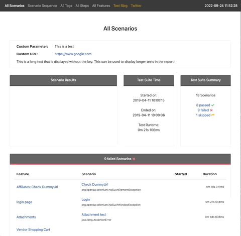

# Cluecumber
_Clear and concise JVM and Maven reporting for the Cucumber BDD JSON format_

This project creates aggregated test reports from Cucumber compatible JSON files that are generated
by [Cucumber BDD](https://github.com/cucumber), [Karate](https://github.com/intuit/karate) and other frameworks.

Cluecumber comes in two flavors:
* [__Cluecumber Core__](core) -  generates reports from Java code
* [__Cluecumber Maven__](maven) - generates reports from Maven

A fully generated example report can be [viewed here](http://cluecumber.softwaretester.blog/)!

## Generated pages

Cluecumber generates the following report pages:

* __All Scenarios__: all scenarios grouped by their status `passed`, `failed` or `skipped`.
* __Scenario Sequence__: all scenarios in running order including their individual status information
* __Scenario Details__: all steps, hooks, stack traces and attachments of a single scenario
* __All Features__: an overview of all features
* __All Tags__: all used tags in scenarios, features and example tables including their individual status information
* __All Steps__: all steps in use including their individual status information
* __Scenarios by Tag__: all scenarios including a specific tag
* __Scenarios by Feature__: all scenarios belonging to a specific feature
* __Scenario by Step__: all scenarios that include a specific step
* __Tree View__: all features and scenarios in a tree for an easy overview of the test suite

## Changelog

All changes are documented in the [full changelog](CHANGELOG.md).

# Appendix

## Building

Cluecumber requires Java >= 11 and Maven >= 3.3.9.
It is available in [Maven central](https://search.maven.org/#search%7Cgav%7C1%7Cg%3A%22com.trivago.rta%22%20AND%20a%3A%22cluecumber-report-plugin%22).

## Star History

## License

Copyright 2018 - 2023 trivago N.V.

Licensed under the Apache License, Version 2.0 (the "License"); you may not use this file except in compliance with the
License. You may obtain a copy of the License at

http://www.apache.org/licenses/LICENSE-2.0

Unless required by applicable law or agreed to in writing, software distributed under the License is distributed on an "
AS IS" BASIS, WITHOUT WARRANTIES OR CONDITIONS OF ANY KIND, either express or implied. See the License for the specific
language governing permissions and limitations under the License.
