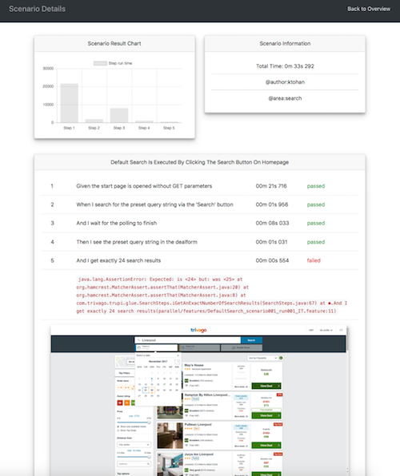

[](http://www.apache.org/licenses/LICENSE-2.0)
[](http://repo1.maven.org/maven2/com/trivago/rta/cluecumber-report-plugin/)
[](https://travis-ci.org/trivago/cluecumber-report-plugin)
[](https://codecov.io/gh/trivago/cluecumber-report-plugin)
[](https://twitter.com/bischoffdev)

<!-- START doctoc generated TOC please keep comment here to allow auto update -->
<!-- DON'T EDIT THIS SECTION, INSTEAD RE-RUN doctoc TO UPDATE -->


- [Cluecumber Report Maven Plugin](#cluecumber-report-maven-plugin)
  - [Prerequisites](#prerequisites)
  - [Maven POM settings](#maven-pom-settings)
    - [Configuration Parameters](#configuration-parameters)
  - [Generated pages](#generated-pages)
    - [Test suite overview page](#test-suite-overview-page)
    - [Scenario detail pages](#scenario-detail-pages)

<!-- END doctoc generated TOC please keep comment here to allow auto update -->


# Cluecumber Report Maven Plugin

This plugin creates test reports from Cucumber JSON files.

This project was created because
- some other projects are using legacy technology and/or were not maintained at all
- some other projects generate partial or even full HTML code in Java making it hard to maintain
- the reporting generated from other plugins showed too much unneeded or even wrong information
- some other projects consume a large amount of memory when generating reports from large JSON files
- it will allow to completely customize the report appearance and information

## Prerequisites

In order to have the JSON files as a source for the Cluecumber Report generation, you need to specify this option in your Cucumber runner configuration:
```
@CucumberOptions(
    format = {"json:target/cucumber-report/cucumber.json"}
)
```

This will generate JSON results for all Cucumber tests.

## Maven POM settings

```xml
<plugin>
    <groupId>com.trivago.rta</groupId>
    <artifactId>cluecumber-report-plugin</artifactId>
    <version>Check the version number above</version>
    <executions>
        <execution>
            <id>report</id>
            <phase>post-integration-test</phase>
            <goals>
                <goal>reporting</goal>
            </goals>
            <configuration>
                <sourceJsonReportDirectory>${project.basedir}/src/main/resources/cucumber-report</sourceJsonReportDirectory>
                <generatedHtmlReportDirectory>${project.build.directory}/cluecumber-report</generatedHtmlReportDirectory>
            </configuration>
        </execution>
    </executions>
</plugin>
```

### Configuration Parameters

There are two parameters that have to be specified:

| Parameter | Explanation |
|---|---|
| sourceJsonReportDirectory | This specifies source folder of the Cucumber JSON result files |
| generatedHtmlReportDirectory | This points to the root directory of the generated Cluecumber HTML report. |

**Note:**
Typically, both properties point to directories inside the Maven ```target``` directory.

## Generated pages

### Test suite overview page

This page shows the most important information about the test suite:
- run time
- number of passed, failed and skipped scenarios
- grouped scenarios by status


### Scenario detail pages

The scenario detail pages can be reached by clicking on the scenario name in the test suite overview page.

It shows:
- scenario name and description
- step runtimes and status
- stack traces of failed steps
- screenshots

