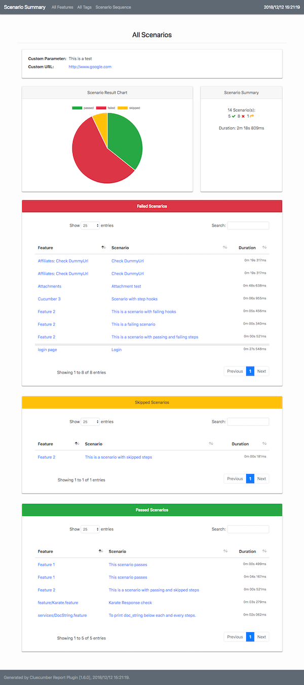
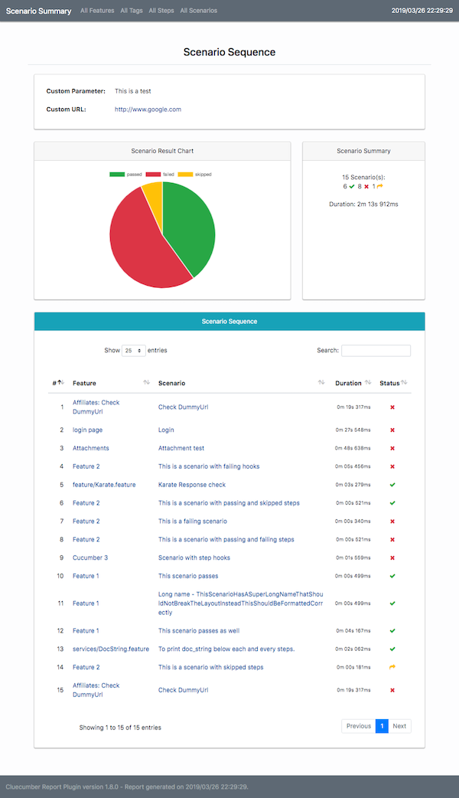
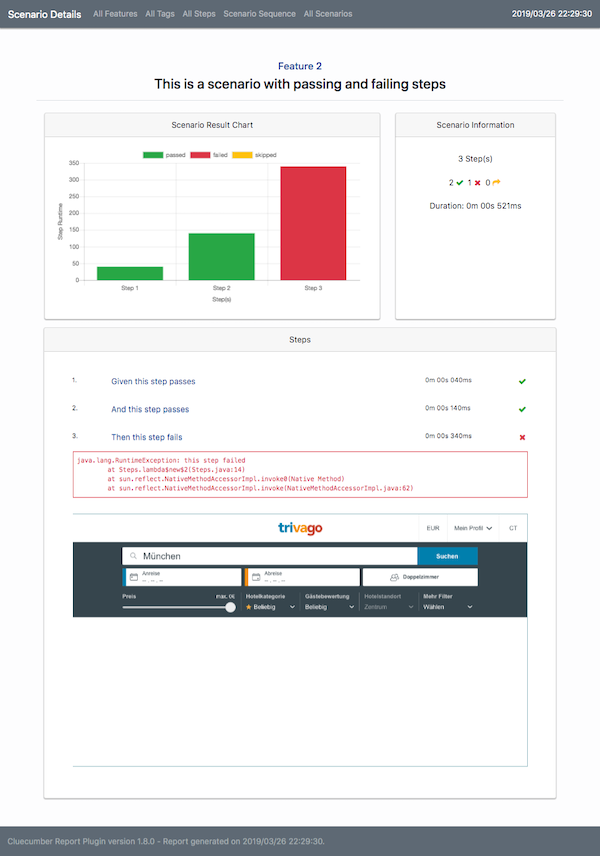
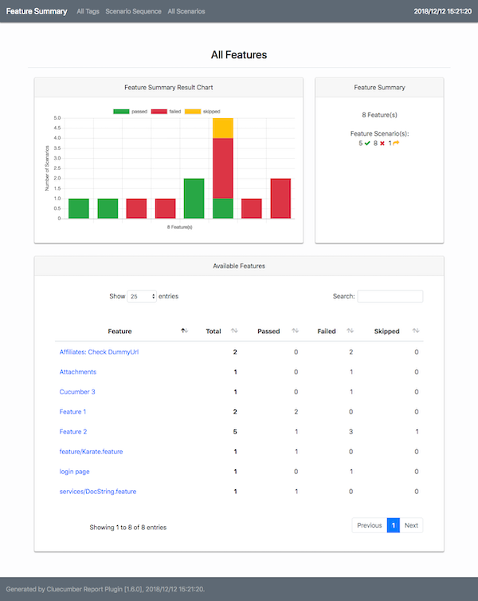
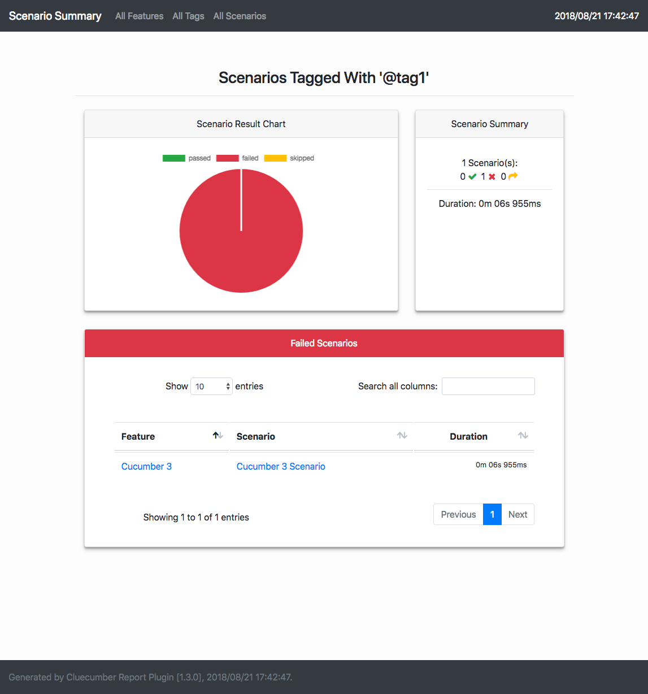
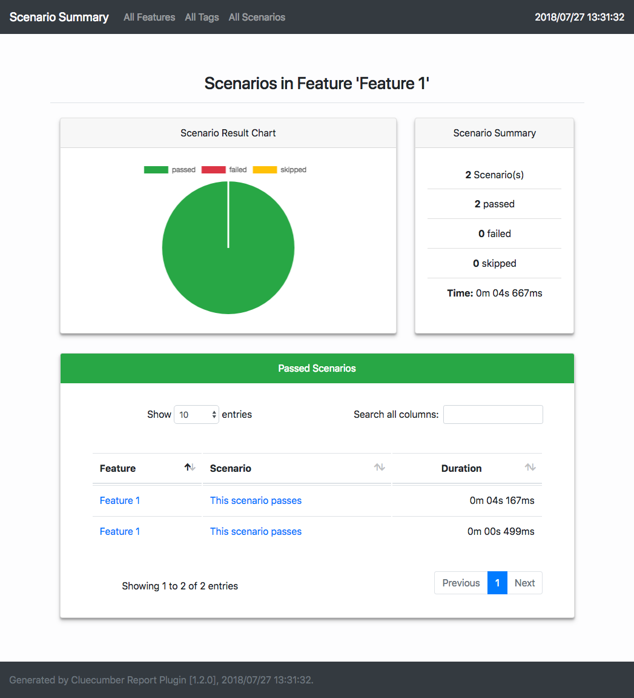

### Clear and Concise Cucumber Reporting

[](http://www.apache.org/licenses/LICENSE-2.0)
[](http://repo1.maven.org/maven2/com/trivago/rta/cluecumber-report-plugin/)
[](https://travis-ci.org/trivago/cluecumber-report-plugin)
[](https://codecov.io/gh/trivago/cluecumber-report-plugin)
[](https://twitter.com/bischoffdev)


<!-- START doctoc generated TOC please keep comment here to allow auto update -->
<!-- DON'T EDIT THIS SECTION, INSTEAD RE-RUN doctoc TO UPDATE -->


- [Cluecumber Report Maven Plugin](#cluecumber-report-maven-plugin)
  - [Example report](#example-report)
  - [Changelog](#changelog)
- [Prerequisites](#prerequisites)
- [Maven POM settings](#maven-pom-settings)
  - [Mandatory Configuration Parameters](#mandatory-configuration-parameters)
    - [sourceJsonReportDirectory](#sourcejsonreportdirectory)
    - [generatedHtmlReportDirectory](#generatedhtmlreportdirectory)
  - [Optional Configuration Parameters](#optional-configuration-parameters)
    - [skip](#skip)
    - [customParameters](#customparameters)
    - [customCSS](#customcss)
    - [expandBeforeAfterHooks, expandStepHooks, expandDocStrings](#expandbeforeafterhooks-expandstephooks-expanddocstrings)
- [Running the reporting goal directly through the command line](#running-the-reporting-goal-directly-through-the-command-line)
  - [Passing properties on the command line](#passing-properties-on-the-command-line)
- [Example project](#example-project)
- [Appendix](#appendix)
  - [Building](#building)
  - [Generated pages](#generated-pages)
    - [All Scenarios](#all-scenarios)
    - [Scenario Sequence](#scenario-sequence)
    - [Scenario Details](#scenario-details)
    - [All Features](#all-features)
    - [All Tags](#all-tags)
    - [Scenario by Tag](#scenario-by-tag)
    - [Scenario by Feature](#scenario-by-feature)
  - [License](#license)

<!-- END doctoc generated TOC please keep comment here to allow auto update -->

# Cluecumber Report Maven Plugin

This plugin creates aggregated test reports from Cucumber compatible JSON files that are generated by [Cucumber BDD](https://github.com/cucumber), [Karate](https://github.com/intuit/karate) and other frameworks.

This project was created because
- some other projects are using legacy technology and/or were not maintained at all
- some other projects generate partial or even full HTML code in Java making it hard to maintain
- the reporting generated from other plugins showed too much unneeded or even wrong information
- some other projects consume a large amount of memory when generating reports from large JSON files
- it allows to customize the report CSS to alter the looks of the generated report

**Note:** If you need to run Cucumber tests in parallel, please check out our [Cucable](https://github.com/trivago/cucable-plugin) project!

## Example report

A fully generated example report can also be [viewed online](http://tech.trivago.com/cluecumber-report-plugin/)!

## Changelog

All changes are documented in the [full changelog](CHANGELOG.md).

# Prerequisites

In order to have the JSON files as a source for the Cluecumber Report generation, you need to specify this option in your Cucumber runner configuration:

*Cucumber 1.x:*
```
@CucumberOptions(
    format = {"json:target/cucumber-report/cucumber.json"}
)
```

*Cucumber >= 2.x:*
```
@CucumberOptions(
    plugin = {"json:target/cucumber-report/cucumber.json"}
)
```

This will generate JSON results for all Cucumber tests.

# Maven POM settings

```xml
<plugin>
    <groupId>com.trivago.rta</groupId>
    <artifactId>cluecumber-report-plugin</artifactId>
    <version>Check the version number above</version>
    <executions>
        <execution>
            <id>report</id>
            <phase>post-integration-test</phase>
            <goals>
                <goal>reporting</goal>
            </goals>
        </execution>
    </executions>
    <configuration>
        <sourceJsonReportDirectory>${project.build.directory}/cucumber-report</sourceJsonReportDirectory>
        <generatedHtmlReportDirectory>${project.build.directory}/generated-report</generatedHtmlReportDirectory>
    </configuration>    
</plugin>
```

## Mandatory Configuration Parameters

There are two mandatory parameters that have to be specified within the Maven POM ```configuration``` section or system properties:

__Note:__ Typically, both properties point to directories inside the Maven ```target``` directory.

### sourceJsonReportDirectory

This specifies the source folder of the Cucumber JSON result files.

### generatedHtmlReportDirectory

This points to the root directory of the generated Cluecumber HTML report.

## Optional Configuration Parameters

### skip

The `skip` property is used to skip the report generation. The default value is `false`

```
<configuration>
    <skip>true</skip>
    ...
</configuration>
```

### customParameters

The `customParameters` block can be used to define custom information that should be displayed on the report start page.

__Note:__ Underscores in the parameter names are automatically turned into spaces in the report.
Valid URLs that start with a protocol (http, https, ftp) are automatically recognized and turned into clickable links.

```
<customParameters>
    <Custom_Parameter>This is a test</Custom_Parameter>
    <Custom_URL>http://www.google.com</Custom_URL>
</customParameters>
```

The property definitions above are shown in the report like this:


### customCSS

The `customCSS` property can be used to define a custom CSS file that will be automatically loaded on top of Cluecumber's default styles.

If you have a custom CSS file called `custom/custom.css` in your project, you could use it to change the report's background and header colors:
```css
body {
    background-color: dimgray;
}

h3, h4 {
    color: orange;
}
```

To use this files, specify it like so in your pom file or as a system property:

```xml
<customCss>custom/custom.css</customCss>
```

When generating the report, this file is automatically included as ```cluecumber_custom.css``` and applied on top of all other styles:


Likewise, if you want to hide elements from the report, e.g. the total time on the start page, you can also add this to the custom css like so:

```css
[data-cluecumber-item="total-scenario-duration"] {
    display: none;
}
```

### expandBeforeAfterHooks, expandStepHooks, expandDocStrings

These options can be set to `true` to expand or collapse before/after hooks, step hooks or docstrings respectively on scenario detail pages.

If they are not set, they default to false. This means that the report user has to use the buttons on a scenario detail page to expand those sections on demand.

```xml
    <expandBeforeAfterHooks>true|false</expandBeforeAfterHooks>
    <expandStepHooks>true|false</expandStepHooks>
    <expandDocStrings>true|false</expandDocStrings>
```

# Running the reporting goal directly through the command line

In some cases it may be desirable to run the reporting as a completely separate step, e.g. in CI pipelines.
This can be done by running

`mvn cluecumber-report:reporting`

directly from the command line.

__Note:__ If you want this invocation to consider the configuration that is included in your POM file,
the configuration block must be outside of your executions block. Otherwise, it only applies to the
specified execution and is ignored when you run `mvn cluecumber-report:reporting` from the command line:

```
<executions>
    <execution>
        <id>report</id>
        <phase>post-integration-test</phase>
        <goals>
            <goal>reporting</goal>
        </goals>
        <configuration>
            <!-- This configuration block applies ONLY to this execution -->
        </configuration>
    </execution>
</executions>
<configuration>
    <!-- This configuration block applies to all executions including command line invocation -->
</configuration>
```

## Passing properties on the command line

You can also pass properties directly on the command line, e.g.

`mvn cluecumber-report:reporting -DsourceJsonReportDirectory=path_to_json_files -D...`

If you want to set a [custom parameter](#custom-parameters), you can do it like this:

Set an empty property in your pom file's properties block:
```xml
<properties>
    <someProperty/>
</properties>
```

Also define it in the Cluecumber section in your POM:

```xml
<customParameters>
    <My_Parameter_Name>${someProperty}</Base_Url>
</customParameters>
```

When invoking the reporting, you can now pass this property via the `-D` option:
```
mvn cluecumber-report:reporting -DsomeProperty="this is cool" -D...
```

__Note:__ If you don't pass this property, Cluecumber will ignore it and not show it in the report.

# Example project

You can test the complete flow and POM configuration by checking out the [Cluecumber example project](example-project).

# Appendix

## Building

Cluecumber requires Java >= 8 and Maven >= 3.3.9.
It is available in [Maven central](https://search.maven.org/#search%7Cgav%7C1%7Cg%3A%22com.trivago.rta%22%20AND%20a%3A%22cluecumber-report-plugin%22).

## Generated pages

### All Scenarios



### Scenario Sequence



### Scenario Details



### All Features



### All Tags


### Scenario by Tag



### Scenario by Feature



## License

Copyright 2018 trivago NV

Licensed under the Apache License, Version 2.0 (the "License"); you may not use this file except in compliance with the License. You may obtain a copy of the License at

http://www.apache.org/licenses/LICENSE-2.0

Unless required by applicable law or agreed to in writing, software distributed under the License is distributed on an "AS IS" BASIS, WITHOUT WARRANTIES OR CONDITIONS OF ANY KIND, either express or implied. See the License for the specific language governing permissions and limitations under the License.
