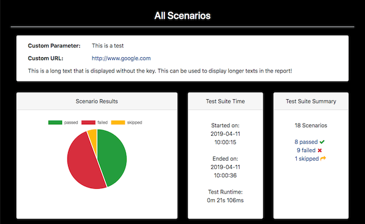
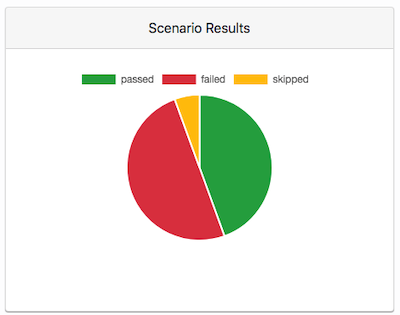

### Clear and concise Maven reporting for the Cucumber BDD JSON format

[](http://www.apache.org/licenses/LICENSE-2.0)
[](https://repo1.maven.org/maven2/com/trivago/rta/cluecumber-maven/)
[](http://cluecumber.softwaretester.blog/)
[](https://hachyderm.io/invite/acrCWhtk)


<!-- START doctoc generated TOC please keep comment here to allow auto update -->
<!-- DON'T EDIT THIS SECTION, INSTEAD RE-RUN doctoc TO UPDATE -->

- [Maven POM settings](#maven-pom-settings)
- [Prerequisites](#prerequisites)
- [Mandatory Configuration Parameters](#mandatory-configuration-parameters)
  - [sourceJsonReportDirectory](#sourcejsonreportdirectory)
  - [generatedHtmlReportDirectory](#generatedhtmlreportdirectory)
- [Optional Configuration Parameters](#optional-configuration-parameters)
  - [Plugin Logging](#plugin-logging)
  - [Add Custom Information to the Report](#add-custom-information-to-the-report)
    - [Add Custom Information Using Properties](#add-custom-information-using-properties)
    - [Add Custom Information Using a File](#add-custom-information-using-a-file)
    - [Where to Display Custom Parameters](#where-to-display-custom-parameters)
  - [Add custom navigation links](#add-custom-navigation-links)
  - [Skip Report Generation](#skip-report-generation)
  - [Fail Scenarios on Pending or Undefined Steps](#fail-scenarios-on-pending-or-undefined-steps)
  - [Auto-expand Certain Report Sections](#auto-expand-certain-report-sections)
  - [Auto-expand Attachments](#auto-expand-attachments)
- [Optional Configuration Parameters for Changing the Report Appearance](#optional-configuration-parameters-for-changing-the-report-appearance)
  - [Defining the report start page](#defining-the-report-start-page)
  - [Defining a custom report title](#defining-a-custom-report-title)
  - [Defining a custom CSS file](#defining-a-custom-css-file)
  - [Defining custom passed, skipped and failed colors](#defining-custom-passed-skipped-and-failed-colors)
- [Running the reporting goal directly via command line](#running-the-reporting-goal-directly-via-command-line)
  - [Passing built-in properties via command line](#passing-built-in-properties-via-command-line)
  - [Passing custom parameters via command line](#passing-custom-parameters-via-command-line)
- [Appendix](#appendix)
  - [Building](#building)
  - [License](#license)

<!-- END doctoc generated TOC please keep comment here to allow auto update -->

# Maven POM settings

```xml
<plugin>
    <groupId>com.trivago.rta</groupId>
    <artifactId>cluecumber-maven</artifactId>
    <version>3.1.0</version>
    <executions>
        <execution>
            <id>report</id>
            <phase>post-integration-test</phase>
            <goals>
                <goal>reporting</goal>
            </goals>
        </execution>
    </executions>
    <configuration>
        <sourceJsonReportDirectory>${project.build.directory}/cucumber-report</sourceJsonReportDirectory>
        <generatedHtmlReportDirectory>${project.build.directory}/generated-report</generatedHtmlReportDirectory>
    </configuration>
</plugin>
```

# Prerequisites

In order to have the JSON files as a source for the Cluecumber Report generation, you need to specify this option in
your Cucumber runner configuration:

```java
@CucumberOptions(
    plugin = {"json:target/cucumber-report/cucumber.json"}
)
```

This will generate JSON results for all Cucumber tests.

# Mandatory Configuration Parameters

There are two mandatory parameters that have to be specified within the Maven POM ```configuration``` section or system
properties:

__Note:__ Typically, both properties point to directories inside the Maven ```target``` directory.

## sourceJsonReportDirectory

This specifies the source folder of the Cucumber JSON result files.

```xml
<configuration>
    <sourceJsonReportDirectory>c:/example/json-files</sourceJsonReportDirectory>
    ...
</configuration>
```

## generatedHtmlReportDirectory

This points to the root directory of the generated Cluecumber HTML report.

```xml
<configuration>
    <generatedHtmlReportDirectory>c:/example/my-report</generatedHtmlReportDirectory>
    ...
</configuration>
```

# Optional Configuration Parameters

## Plugin Logging

By default, Cluecumber logs all information including

* its own name and version
* all passed property values
* the generated report location

This can be configured by passing the `logLevel` property:

```xml
<logLevel>default|compact|minimal|off</logLevel>
```

* _default_ will log all the mentioned information
* _compact_ will only log the source and target directories, plugin name and version and the generated report location
* _minimal_ will only log the generated report location
* _off_ will prevent any logging

## Add Custom Information to the Report

### Add Custom Information Using Properties

The `customParameters` block can be used to define custom information that should be displayed on the report start page.

__Note:__ Underscores in the parameter names are automatically turned into spaces in the report.
Valid URLs that start with a protocol (http, https, ftp) are automatically recognized and turned into clickable links.
If a parameter name starts with an underscore (`_`), only the value is displayed.

```xml
<configuration>
    <customParameters>
        <Custom_Parameter>This is a test</Custom_Parameter>
        <Custom_URL>http://www.google.com</Custom_URL>
        <_Text>This is a long text that is displayed without the key. This can be used to display longer texts in the
            report!
        </_Text>
    </customParameters>
    ...
</configuration>
```

The property definitions above are shown in the report like this:


### Add Custom Information Using a File

You can also set custom parameters by specifying the path to a `.properties` file in the `customParametersFile` property
like this:

```xml
<configuration>
    <customParametersFile>path/to/your/customParameters.properties</customParametersFile>
    ...
</configuration>
```

This file needs to have a format like this:

```properties
Custom_Parameter=This is a test
Custom_URL=http://www.google.com
_Text=This is a long text that is displayed without the key. This can be used to display longer texts in the report!
```

__Note:__ These custom parameters behave exactly like the ones defined by the `customParameters` property and will be
added on top of already defined properties.
If a property has the same name as an existing one, its value will be overwritten!

The property definitions above are shown in the report like this:


### Where to Display Custom Parameters

You can decide how to display the custom parameters in the report using the `customParametersDisplayMode` property.

The following display modes are available for displaying the custom parameters:

* `SCENARIO_PAGES`: Displays only on the scenario and scenario sequence pages. (_default_)
* `ALL_PAGES`: Display on all the pages in the report.

```xml
<configuration>
    <customParametersDisplayMode>ALL_PAGES</customParametersDisplayMode>
    ...
</configuration>
```

The default value for this property is `SCENARIO_PAGES`.

## Add custom navigation links

If you have other pages or files you want to make accessible from the central navigation bar,
this is possible via the `customNavigationLinks` property.

```xml
<configuration>
    <customNavigationLinks>
        <Test_Blog>https://www.softwaretester.blog</Test_Blog>
        <Twitter>https://twitter.com/BischoffDev</Twitter>
    </customNavigationLinks>
    ...
</configuration>
```

These links will be added to the right of the navigation bar. If there are underscores ("_") in the property key,
these are replaces with spaces for the link name:


## Skip Report Generation

The `skip` property is used to skip the report generation. The default value is `false`

```xml
<configuration>
    <skip>true</skip>
    ...
</configuration>
```

## Fail Scenarios on Pending or Undefined Steps

The optional `failScenariosOnPendingOrUndefinedSteps` property can be set to `true` if you scenarios should be marked
as `failed` when they contain `pending` or `skipped` steps.
The default setting is `false`, meaning that those scenarios will be marked as `skipped`.

```xml
<configuration>
    <failScenariosOnPendingOrUndefinedSteps>true</failScenariosOnPendingOrUndefinedSteps>
    ...
</configuration>
```

## Auto-expand Certain Report Sections

The `expandBeforeAfterHooks`, `expandStepHooks` and `expandDocStrings` options can be set to `true` to expand or
collapse before/after hooks, step hooks or docstrings respectively on scenario detail pages.

If they are not set, they default to false. This means that the report user has to use the buttons on a scenario detail
page to expand those sections on demand.

```xml
<configuration>
    <expandBeforeAfterHooks>true|false</expandBeforeAfterHooks>
    <expandStepHooks>true|false</expandStepHooks>
    <expandDocStrings>true|false</expandDocStrings>
    ...
</configuration>
```

## Auto-expand Attachments

By default, attachments are collapsed and can be toggled individually. If the `expandAttachments` options is set
to `true`, they are automatically expanded.

```xml
<configuration>
    <expandAttachments>true|false</expandAttachments>
    ...
</configuration>
```

# Optional Configuration Parameters for Changing the Report Appearance

## Defining the report start page

The default start page of the reports (if not overwritten by the `startPage` property) is the scenario overview page.

```xml
<configuration>
    <startPage>ALL_SCENARIOS</startPage>
    ...
</configuration>
```

This can be customized with one of the following values:

* `ALL_SCENARIOS` (scenario overview page, default)
* `SCENARIO_SEQUENCE` (scenario sequence page)
* `ALL_TAGS` (tag overview page)
* `ALL_STEPS` (step overview page)
* `ALL_FEATURES` (feature overview page)
* `TREE_VIEW` (tree view of features and scenarios)

## Defining a custom report title

By default, the page html title of the report pages is `Cluecumber Report` plus the current page name,
e.g. `Cluecumber Report - All Tags`.

By setting the property `customPageTitle`, this can be changed:

```xml
<configuration>
    <customPageTitle>My Report</customPageTitle>
    ...
</configuration>
```

This would lead to a report title like this:


## Defining a custom CSS file

The `customCSS` property can be used to define a custom CSS file that will be automatically loaded on top of
Cluecumber's default styles.

If you have a custom CSS file called `custom/custom.css` in your project, you could use it to change the report's
background and header colors:

```css
body {
    background-color: black;
}

h3, h4, h5 {
    color: white;
}
```

To use this files, specify it like so in your pom file or as a system property:

```xml
<configuration>
    <customCss>custom/custom.css</customCss>
    ...
</configuration>
```

When generating the report, this file is automatically included as ```cluecumber_custom.css``` and applied on top of all
other styles:



Likewise, if you want to hide elements from the report, you can also add this to the custom css like so:

```css
.some_element {
    display: none;
}
```

## Defining custom passed, skipped and failed colors

It is possible to set these properties to change the color scheme for passed, failed and skipped steps and scenarios
including the displayed diagrams. The values have to be valid hex colors:

```xml
<configuration>
    <customStatusColorPassed>#017FAF</customStatusColorPassed>
    <customStatusColorFailed>#C94A38</customStatusColorFailed>
    <customStatusColorSkipped>#F48F00</customStatusColorSkipped>
    ...
</configuration>    
```

The result of this customization is:

| Before | After |
|---|---|
|  |  |

# Running the reporting goal directly via command line

In some cases it may be desirable to run the reporting as a completely separate step, e.g. in CI pipelines.
This can be done by running

`mvn cluecumber:reporting`

directly from the command line.

__Note:__ If you want this invocation to consider the configuration that is included in your POM file,
the `configuration` block must be outside of your `executions` block. Otherwise, it only applies to the
specified execution and is ignored when you run `mvn cluecumber-report:reporting` from the command line:

```xml
<executions>
    <execution>
        <id>report</id>
        <phase>post-integration-test</phase>
        <goals>
            <goal>reporting</goal>
        </goals>
        <configuration>
            <!-- This configuration block applies ONLY to this execution -->
        </configuration>
    </execution>
</executions>
<configuration>
    <!-- This configuration block applies to all executions including command line invocation -->
</configuration>
```

## Passing built-in properties via command line

You can also pass built-in properties directly on the command line, e.g.

`mvn cluecumber:reporting -Dreporting.startPage=ALL_TAGS`

These properties start with `reporting.`!

__Note:__ You can only pass built-in properties like this if they are not already defined in your `pom.xml` file!

## Passing custom parameters via command line

If you want to set a [custom parameter](#customparameters), you can do it like this:

Set an empty property in your pom file's properties block:

```xml
<properties>
    <someProperty/>
</properties>
```

Also define it in the Cluecumber section in your POM:

```xml
<customParameters>
    <My_Parameter_Name>${someProperty}</Base_Url>
</customParameters>
```

When invoking the reporting, you can now pass this property via the `-D` option:

```bash
mvn cluecumber:reporting -DsomeProperty="this is cool" -D...
```

__Note:__ If you don't pass this property, Cluecumber will ignore it and not show it in the report.

# Appendix

## Building

Cluecumber requires Java >= 11 and Maven >= 3.3.9.
It is available
in [Maven central](https://search.maven.org/#search%7Cgav%7C1%7Cg%3A%22com.trivago.rta%22%20AND%20a%3A%22cluecumber-report-plugin%22).

## License

Copyright 2018 - 2022 trivago N.V.

Licensed under the Apache License, Version 2.0 (the "License"); you may not use this file except in compliance with the
License. You may obtain a copy of the License at

http://www.apache.org/licenses/LICENSE-2.0

Unless required by applicable law or agreed to in writing, software distributed under the License is distributed on an "
AS IS" BASIS, WITHOUT WARRANTIES OR CONDITIONS OF ANY KIND, either express or implied. See the License for the specific
language governing permissions and limitations under the License.
